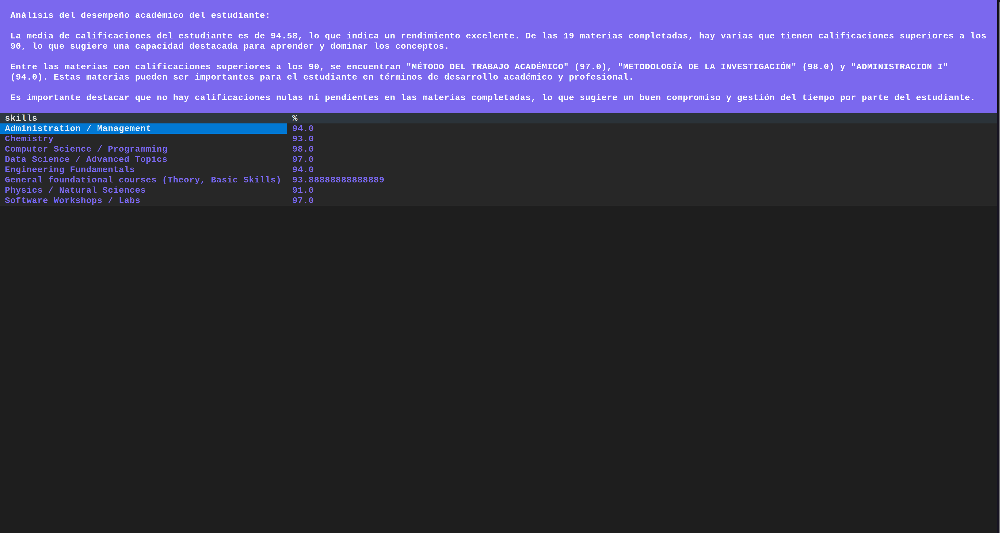

# University Academic Tracker (Pensum TUI)

A terminal-based academic tracking application designed to help university students monitor their progress, analyze course performance, and generate predictive insights. Built in Python using the [Textual](https://github.com/Textualize/textual) TUI library.

---

## Table of Contents

- [Features](#features)  
- [Screenshots](#screenshots)  
- [Installation](#installation)  
- [Usage](#usage)  
- [Project Structure](#project-structure)  
- [Future Work](#future-work)  
- [License](#license)  

---

## Features

- Load university curriculum data from CSV or PDF files.  
- Display academic progress in a user-friendly terminal interface.  
- Highlight completed, pending, and missing courses.  
- Summarize student performance and generate predictive insights using a LLaMA-based AI model.
- Modular structure for easy expansion (future AI assistant integration, predictive analytics, reporting features).
- Add grades and mark courses as completed.
- Generate PDF reports from CSV data. 

---

## Screenshots


### Main Dashboard


### Course Table View


### Performance Summary


---

## Installation

1. Clone the repository:

```
git clone https://github.com/yourusername/pensum-tui.git
cd pensum-tui
```
2. Install dependencies:

```
pip install -r requirements.txt
```
## Usage
Run the TUI application with:
```
python3 -m scripts.pensum_tui_refactor
```
**Tip:** Using -m ensures Python treats the scripts folder as a module, which is required to properly visualize the TUI.
Navigate through the interface using arrow keys, enter, and other standard keyboard controls.

## Project Structure

```
pensum-tui/
├── data/                  # Example curriculum CSVs/PDFs
├── screenshots/           # Screenshots for documentation
├── scripts/
│   ├── pensum_tui_refactor.py
│   ├── loader.py
│   └── utils.py
├── requirements.txt
└── README.md
```
* ***scripts/pensum_tui_refactor.py*** → Main TUI application entry point.
* ***scripts/loader.py*** → Handles CSV/PDF data loading.
* ***scripts/utils.py*** → Utility functions and helpers.

## Future Work
* Complete pending modules for AI-assisted academic recommendations.
* Integrate predictive models for performance forecasting.
* Enable live tracking with audio/video class recording (record classes tab).
* Add enhanced reporting screens and data visualization.

## License
This project is for personal and educational use only. All rights reserved.


